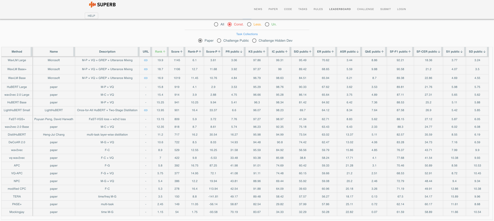

# LightHuBERT

<!--**Compress pre-trained models for speech representation learning**-->

[**LightHuBERT**](https://arxiv.org/abs/2203.15610): **Lightweight and Configurable Speech Representation Learning with Once-for-All Hidden-Unit BERT**

| [**Github**](https://github.com/mechanicalsea/lighthubert) | [**Huggingface**](https://huggingface.co/mechanicalsea/lighthubert) | [**SUPERB Leaderboard**](https://superbbenchmark.org/leaderboard) |

The authors' PyTorch implementation and pretrained models of LightHuBERT.

- June 2022: LightHuBERT has been accepted to Interspeech 2022
- May 2022: LightHuBERT Small is available in [s3prl](https://github.com/s3prl/s3prl/blob/68c99750605b2221611a5eb201b59c2cc42ad5f1/s3prl/upstream/lighthubert/expert.py).
- March 2022: release preprint in [arXiv](https://arxiv.org/abs/2203.15610) and checkpoints in [huggingface](https://huggingface.co/mechanicalsea/lighthubert).

## Pre-Trained Models

| Model | Pre-Training Dataset | Download Link |
|---|---|---|
|LightHuBERT Base| [960 hrs LibriSpeech](http://www.openslr.org/12) | huggingface: [lighthubert/lighthubert_base.pt](https://huggingface.co/mechanicalsea/lighthubert/resolve/main/lighthubert_base.pt) |
|LightHuBERT Small| [960 hrs LibriSpeech](http://www.openslr.org/12) | huggingface: [lighthubert/lighthubert_small.pt](https://huggingface.co/mechanicalsea/lighthubert/resolve/main/lighthubert_small.pt) |
|LightHuBERT Stage 1| [960 hrs LibriSpeech](http://www.openslr.org/12) | huggingface: [lighthubert/lighthubert_stage1.pt](https://huggingface.co/mechanicalsea/lighthubert/resolve/main/lighthubert_stage1.pt) |

Actually, the pre-trained is trained in `common.fp16: true` so that we can perform model inference with `fp16` weights.

## Requirements and Installation

- PyTorch version >= 1.8.1
- Python version >= 3.6
- numpy version >= 1.19.3
- To install lighthubert:

```sh
git clone git@github.com:mechanicalsea/lighthubert.git
cd lighthubert
pip install --editable .
```

## Load Pre-Trained Models for Inference

```python
import torch
from lighthubert import LightHuBERT, LightHuBERTConfig

wav_input_16khz = torch.randn(1,10000).cuda()

# load the pre-trained checkpoints
checkpoint = torch.load('/path/to/lighthubert.pt')
cfg = LightHuBERTConfig(checkpoint['cfg']['model'])
cfg.supernet_type = 'base'
model = LightHuBERT(cfg)
model = model.cuda()
model = model.eval()
print(model.load_state_dict(checkpoint['model'], strict=False))

# (optional) set a subnet
subnet = model.supernet.sample_subnet()
model.set_sample_config(subnet)
params = model.calc_sampled_param_num()
print(f"subnet (Params {params / 1e6:.0f}M) | {subnet}")

# extract the the representation of last layer
rep = model.extract_features(wav_input_16khz)[0]

# extract the the representation of each layer
hs = model.extract_features(wav_input_16khz, ret_hs=True)[0]

print(f"Representation at bottom hidden states: {torch.allclose(rep, hs[-1])}")
```

More examples can be found in our [tutorials](./tutorials/LightHuBERT.ipynb).

## Universal Representation Evaluation on SUPERB



## Profiling LightHuBERT

As mentioned in [Profiling Tool for SLT2022 SUPERB Challenge](https://github.com/B06901052/DeepSpeed/tree/superb-challenge), we profiling the `lighthubert` in s3prl.

```sh
cd DeepSpeed
# lighthubert_small
python testing/s3prl_profiling_test.py -u lighthubert_small --libri_root "libri_root"
# lighthubert_base
python testing/s3prl_profiling_test.py -u lighthubert_base --libri_root "libri_root"
# lighthubert_stage1
python testing/s3prl_profiling_test.py -u lighthubert_stage1 --libri_root "libri_root"
```

## License

This project is licensed under the license found in the LICENSE file in the root directory of this source tree.
Portions of the source code are based on the [FAIRSEQ](https://github.com/pytorch/fairseq) project.

### Reference

If you find our work is useful in your research, please cite the following paper:

```bibtex
@inproceedings{wang2022lighthubert,
  title={{LightHuBERT}: Lightweight and Configurable Speech Representation Learning with Once-for-All Hidden-Unit {BERT}},
  author={Rui Wang and Qibing Bai and Junyi Ao and Long Zhou and Zhixiang Xiong and Zhihua Wei and Yu Zhang and Tom Ko and Haizhou Li},
  booktitle={Proceedings of the Interspeech},
  year={2022}
}
```

### Contact Information

For help or issues using LightHuBERT models, please submit a GitHub issue.

For other communications related to LightHuBERT, please contact Rui Wang (`rwang@tongji.edu.cn`).
